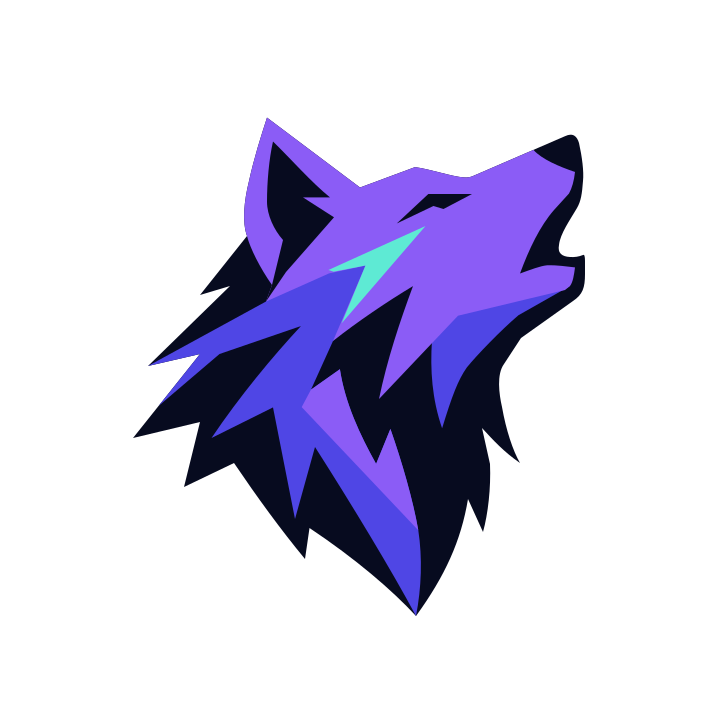
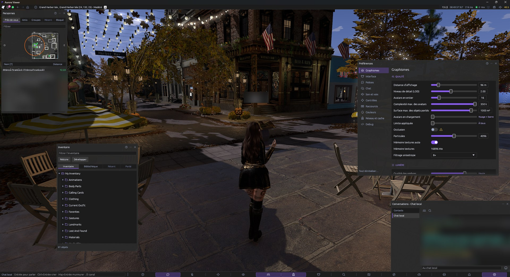
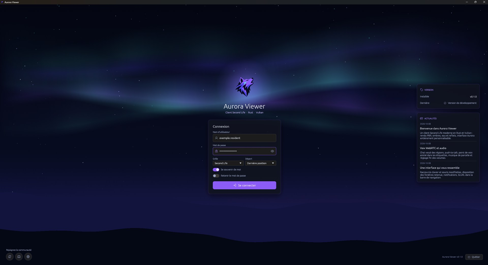

<div align="center">



# Aurora Viewer

**A modern Second Life viewer written in Rust.**

[](https://github.com/Aurora-Viewer/Aurora-Viewer/actions/workflows/ci.yml)
[](https://github.com/Aurora-Viewer/Aurora-Viewer/releases)
[](LICENSE)
[](https://www.rust-lang.org)
[](#build)

[Français](#en-français) · [Build](#build) · [Test switches](#test-switches) · [Contributing](#contributing)

</div>



Aurora Viewer is a Second Life client built from scratch in Rust, with a
modern GPU renderer (wgpu on Vulkan) and a clean, flat interface. It follows
the behaviour of [Firestorm](https://www.firestormviewer.org) — same protocol,
same rules, same defaults — while rethinking the user interface.

> **Status:** early development (0.x). Usable for exploring, chatting and
> testing; many features are still in progress — see [TASKS.md](TASKS.md).

## Highlights

- **Rendering** — wgpu / Vulkan, bindless textures, multi-draw-indirect,
  PBR and legacy materials, shadows, reflection probes, water, glow,
  particles, GPU occlusion (experimental).
- **Avatars** — skeleton and Bento animations blended like Firestorm,
  server bakes, shape, rigged mesh, complexity limits, impostors, look-at.
- **World** — prims, sculpts, mesh with LOD, terrain, EEP environment,
  world sounds, parcel music, media on prims.
- **Social** — local chat, IMs and groups, people list, blocking,
  notifications, voice (WebRTC).
- **Interface** — flat Aurora theme, Phosphor icons, mini-map and world map,
  inventory, preferences, debug overlays.



## Build

Requirements: Windows 10/11, [Rust](https://rustup.rs) (stable, selected
automatically by `rust-toolchain.toml`), a GPU with Vulkan support.

**Development environment:** create a folder for the project, clone this
repository into it, then double-click **`aurora-tools.cmd`**:

```bat
git clone https://github.com/Aurora-Viewer/Aurora-Viewer aurora-viewer
```

The tools check the environment and offer to **repair** it: they install
whatever is missing (GitHub CLI, the Visual Studio C++ tools, Rust), clone
the Firestorm sources next to the repository, and download the emoji font,
the Rust toolchain and the crates. Then, driven by the keyboard: release /
dev / debug viewers, demo, agents' tasks, disk, logs, live pull requests with
Windows notifications, releases (see
[HUMANS.md](HUMANS.md)).

Without Git yet, this command (in a command prompt, in the project folder)
installs everything, Git included:

```bat
powershell -NoProfile -ExecutionPolicy Bypass -Command "$f = Join-Path $env:TEMP 'aurora-setup.ps1'; irm https://raw.githubusercontent.com/Aurora-Viewer/Aurora-Viewer/main/scripts/setup.ps1 -OutFile $f; & $f"
```

Or by hand, to build the viewer only:

```powershell
git clone https://github.com/Aurora-Viewer/Aurora-Viewer aurora-viewer
cd aurora-viewer
./scripts/fetch-assets.ps1          # emoji font (too large for git)
cargo build --release -p aurora-viewer
./target/release/aurora-viewer.exe
```

Run the same checks as the CI with `./scripts/check.ps1` (rustfmt, clippy
with warnings as errors, tests). Day-to-day development uses the default
profile (`cargo run -p aurora-viewer`): it behaves like the release build
without its slow link-time optimization. `./scripts/build-release.ps1`
builds GitHub's latest `main` with `--release` into `..\RELEASE\`.

### Command line

| Argument | Effect |
|---|---|
| `--title <text>` | Window title "Aurora Viewer — <text>"; log file `aurora-<text>.log` (`aurora-demo-<text>.log` in demo mode) |
| `-h`, `--help` | Show the help |

### Test switches

The offline **demo mode** simulates a server locally (a plaza, avatars,
objects, chat, notifications…): no connection, no account. It keeps its own
settings and cache (`…\config\demo`, `…\cache\demo`).

| Variable | Effect |
|---|---|
| `AURORA_DEMO=1` | Offline demo mode |
| `AURORA_CAPTURE=<file.png>` | Save a capture of the frame (`AURORA_CAPTURE_FRAMES`, default 240; ~620 to pass the loading fade) |
| `AURORA_CAPTURE_EXIT=1` | Quit after the capture |
| `AURORA_DEMO_CAM="yaw,pitch,dist"` | Camera heading offset and pitch around the avatar (radians, positive pitch looks down) and distance (meters) |
| `AURORA_DEMO_CAMERA=alt,x,y\|pan,x,y\|zoom,x,y\|tag\|ml\|wheel\|fly\|sit` | Camera scenario logged as `demo camera`: Alt+click at (x, y) then a drag and a walk back, a press on our own name tag then a drag (steering), mouselook in / out, wheel, flight lag, sitting on a turning seat with a sit camera (`camera/demo.rs`) |
| `AURORA_DEMO_ACTIONS=1\|sit\|buy\|pay\|none\|touch\|disabled\|ignore\|ignore-build\|open\|play\|pause\|open-media\|open-media-playing\|zoom\|grab\|buy-confirm\|pay-confirm\|linked-touch\|linked-sit` | Curseurs et clics d'objet comme Firestorm. `1` : tous les objets pour un test manuel ; modes nommés : cible isolée, survol et clic par le chemin habituel. NONE / TOUCH envoie appui, déplacement et relâché ; Grab simule le déplacement physique. IGNORE traverse un écran visible et ouvre Buy derrière ; DISABLED arrête le clic sans toucher ; `ignore-build` sélectionne cet écran en construction. Open affiche trois éléments de contenu simulés. Play lance une page HTML locale ; Pause et `open-media-playing` injectent un état de lecture simulé avant le clic. Open Media simule l'ouverture du navigateur externe. Zoom cadre le cube. `*-confirm` confirme la transaction simulée. `linked-touch` / `linked-sit` : racine creuse avec Touch et siège enfant Sit, boîtes englobantes recouvrantes ; vérifie la prim effectivement visée. Aucun L$ réel ni connexion à une grille. |
| `AURORA_DEMO_POS="x,y"` | Start position |
| `AURORA_DEMO_ACTIONS=pay-layout\|pay-hidden\|pay-large\|buy-original\|buy-contents\|buy-empty` | Fenêtres de transaction : quatre montants à quatre chiffres, champ libre et boutons masqués, montant maximal ; achat d'un original, d'une copie (`buy`) ou du contenu, liste des éléments inclus et permissions du prochain propriétaire ; `buy-empty` propose un contenu non vendable et désactive l'achat. |
| `AURORA_DEMO_DIALOG=12\|4\|long` | Menu llDialog de douze réponses sur trois colonnes, rangées du bas vers le haut comme Firestorm ; quatre réponses pour vérifier la dernière rangée incomplète, ou libellé long tronqué avec texte complet au survol. Boutons Bloquer et Ignorer sous le menu. |
| `AURORA_DEMO_TP=1` or `"x,y,z"` | Simulated teleport at frame 240 |
| `AURORA_DEMO_CHATCMD="calc 2+2;rolld 2 20"` | Lines typed in the chat bar at frame 240, separated by `;` (chat bar commands: `calc`, `rolld`, `gtp`…) |
| `AURORA_DEMO_SIT=n` | Click the toolbar sit button n times (frames 240, 300, 360…) |
| `AURORA_DEMO_KEY=down\|up\|left\|right` | Hold an arrow key from frame 235 (movement, body orientation) |
| `AURORA_DEMO_ANIM_LOOP=1` | Loop with a missing first interval, changing sequence every 120 frames and stopping/restarting at frames 960/1020 every 1200 frames |
| `AURORA_DEMO_ANIMESH=1` | Animated root mesh, linked mesh signaled by a child, and worn animesh with independent custom skeletons and alpha shadows |
| `AURORA_DEMO_MMO="x,y[,1]"` | Left press on the avatar then right button held (mouse steering) |
| `AURORA_DEMO_RCLICK="x,y"\|tag` | Right click (context menu) at (x, y) at frame 225, or on the name tag of the nearest other avatar at frame 600 |
| `AURORA_DEMO_POINTER="x,y[,r][;x,y…]"` | Move the interface pointer to these window pixels from frame 300, one point every 60 frames (hover states, sub-menus); `,r` right-clicks the interface there (menus of lists and names) |
| `AURORA_DEMO_LOOKAT=1` | Eye tracking on (in memory only) and a remote look-at |
| `AURORA_DEMO_SOUND=1` | Audible world sounds (looped chime) and interface sounds (from the real sound cache when present, else a short tick per sound) |
| `AURORA_DEMO_CLOUD=1` | Loading clouds for avatars |
| `AURORA_DEMO_OCCLUSION=1` | Wall with hidden objects (occlusion test) |
| `AURORA_DEMO_PLANAR=1` | Floor slabs with planar texture mapping (tiles must line up across slabs) |
| `AURORA_DEMO_PBR_OVERRIDE=1` | Two PBR slabs, one with a GLTF material override (4 × 4 repeats, tint) |
| `AURORA_DEMO_SKY=<gamma>` | Classic EEP sky (no reflection probe ambiance) with this sky gamma and a sunlight color above 1: legacy gamma and normalized object light as Firestorm |
| `AURORA_DEMO_DEBUG="bounds,culling,lights,probes,skeletons,alpha,wire,complexity,glow,glow_view,freeze"` | Debug overlays |
| `AURORA_DEMO_OPTIONS=<tab>` | Open the preferences on a tab |
| `AURORA_DEMO_KEYBOARD=system\|wasd\|zqsd\|fallback` | Use fresh movement defaults with the Windows layout, simulated QWERTY / AZERTY, or failed detection; combine with `AURORA_DEMO_OPTIONS=8` to inspect secondary bindings |
| `AURORA_DEMO_PERF=compact\|full` | Open the performance window in its compact or full view |
| `AURORA_DEMO_UI=<tab>` | Open people (tab), inventory and chat |
| `AURORA_DEMO_LOGIN=remembered\|empty` | Offline login screen with a synthetic saved-password marker or an empty password field (no grid or credential-store access) |
| `AURORA_DEMO_MAP=1` or `mini` | World map and mini-map |
| `AURORA_DEMO_NOTIF=1`, `AURORA_DEMO_STATUSMENU=1`, `AURORA_DEMO_NAVEDIT=1` | Notification list, status menu, location field |
| `AURORA_DEMO_CONV=1`, `AURORA_DEMO_TALK=1` | Group conversation, microphone on |
| `AURORA_DEMO_LAND=<onglet>[:owner]` | About Land on a tab (`general`, `reglement`, `objets`, `options`, `medias`, `son`, `acces`, `experiences`, `environnement` or its index); `:owner` makes the avatar own the parcel (controls enabled), else it belongs to a group without powers |
| `AURORA_DEMO_CONTACTS=amis\|groupes\|cercles\|detache\|ajout` | Contacts tab of Conversations on Friends, Groups or Contact sets (demo sets and aliases), the torn-off Contacts window, or the resident picker of « Ajouter... » |
| `AURORA_DEMO_PROFILE=loup\|nova\|friend\|self[:tab]` | A profile window (tab 0 2nd life, 1 feed, 2 picks, 3 classifieds, 4 1st life, 5 notes) |
| `AURORA_DEMO_FEED=<url>` | Profile "Flux" tab on this page (the username and `/?feed_only=true` are appended, a `data:` URL can comment them out) |
| `AURORA_DEMO_DISPLAYNAME="name"`, `AURORA_DEMO_DISPLAYNAME_ERROR=…` | Display name change (simulated) |
| `AURORA_DEMO_MEDIA=<url>\|1`, `AURORA_DEMO_PARCEL_MEDIA=<url>\|1`, `AURORA_DEMO_MEDIA_CLICK=…` | Media on a prim, parcel media, media input |
| `AURORA_DEMO_MUSIC=<url>\|1` | Parcel music on the demo parcel (`1`: an unreachable placeholder); it waits for the radio button |
| `AURORA_DEMO_BUILD="mode,x,y[,part,dx,dy]"`, `AURORA_DEMO_BUILD_FRAME` | Build tools script (mode: move, rotate, stretch, face, align, grab, focus, create, land, select) |
| `AURORA_DEMO_BUILD_TAB=general\|object\|features\|texture[:pbr\|bp\|media]\|contents` | Build floater tab shown by the build script; `+weights`, `+grid`, `+media` also open those floaters |
| `AURORA_DEMO_BAN=1` | Ban lines |
| `AURORA_DEMO_RESTRICTED=1` | Parcel that forbids everything (red parcel icons, damage on, 72 % health) |
| `AURORA_DEMO_LSL_BRIDGE=1` | Firestorm LSL bridge messages (hidden) between two owner-say lines |
| `AURORA_DEMO_TOD=0..4` | Time of day |
| `AURORA_DEMO_EEP_PARCEL=1\|parcel\|default\|stale` | EEP answers replayed like the grid (`demo_eep.rs`): a dusk region day then, 0.4 s later, the agent's parcel without a day (`1`: the dusk stays), with its own noon day (`parcel`: 5 s crossfade), a region without a day (`default`: Firestorm's default day asset, the built-in default sky offline) or answers for another parcel and another region (`stale`: ignored) |
| `AURORA_MAX_AVATARS`, `AURORA_MAX_COMPLEXITY`, `AURORA_AA`, `AURORA_SHADOWS` | Override these settings |
| `AURORA_NO_OCCLUSION=1`, `AURORA_NOVSYNC=1` | Turn GPU occlusion / vsync off |
| `AURORA_PROFILE=1` | Profiling in the log: renderer steps and GPU time by element every frame (`render profile`, `gpu profile`), and once a second a `perf summary` line (frame rate, frame time avg / p95 / max, CPU time by step of the frame and of the renderer (`r_*`), GPU time by element (`g_*`), draws and draw commands, synced / rebuilt objects, posed avatars, bytes of records and palettes sent to the GPU, texture and geometry memory) plus a `perf settings` line when the settings change |
| `AURORA_GPU_VALIDATION=1` | wgpu validation layers |
| `AURORA_DEBUG_GLOW=1`, `AURORA_GLOW_SKIP=<mask>`, `AURORA_MEDIA_DEBUG=1` | Renderer and media diagnostics |
| `AURORA_EMOJI_FONT=<path>` | Use another emoji font |
| `AURORA_LOG_NAME=<name>` | Log file name |

Logs are in `%LOCALAPPDATA%\Aurora\AuroraViewer\data\logs\`.

## Contributing

This repository is worked on by humans together with AI agents, each agent on
its own task in its own git worktree:

- [AGENTS.md](AGENTS.md) — rules for AI agents (testing, safety, PRs, reviews)
- [HUMANS.md](HUMANS.md) — how the repository works for humans
- [ARCHITECTURE.md](ARCHITECTURE.md) — scope, crates and file layout
- [TASKS.md](TASKS.md) — what is done, in progress and to do
- [docs/BRANDING.md](docs/BRANDING.md) — palette, logos, icons and UI rules

Behaviour follows Firestorm: its sources are expected next to the repository
(`../phoenix-firestorm`, cloned from
[FirestormViewer/phoenix-firestorm](https://github.com/FirestormViewer/phoenix-firestorm)).

## License

Aurora Viewer is free software under the
[GNU General Public License v3.0 or later](LICENSE). Parts of it are ported
from the Second Life viewer and Firestorm (originally LGPL 2.1); see
[NOTICE.md](NOTICE.md) for details and third-party licenses.

Aurora Viewer is not affiliated with Linden Lab or the Firestorm project.
Second Life® is a trademark of Linden Research, Inc.

---

## En français

**Aurora Viewer** est un viewer Second Life moderne écrit en Rust : rendu GPU
récent (wgpu / Vulkan), interface plate et soignée, et un comportement fidèle
à Firestorm (mêmes messages, mêmes règles, mêmes valeurs par défaut).

- **Compiler :** voir [Build](#build) ci-dessus (Windows, Rust stable).
- **Tester sans compte :** `AURORA_DEMO=1` lance un mode démo hors ligne ;
  la liste des options est dans [Test switches](#test-switches).
- **Contribuer :** le dépôt est pensé pour des humains travaillant avec des
  agents IA ; lis [HUMANS.md](HUMANS.md) (humains) et
  [AGENTS.md](AGENTS.md) (agents). Le suivi des tâches est dans
  [TASKS.md](TASKS.md).
- **Licence :** GPL-3.0-or-later, voir [NOTICE.md](NOTICE.md).
